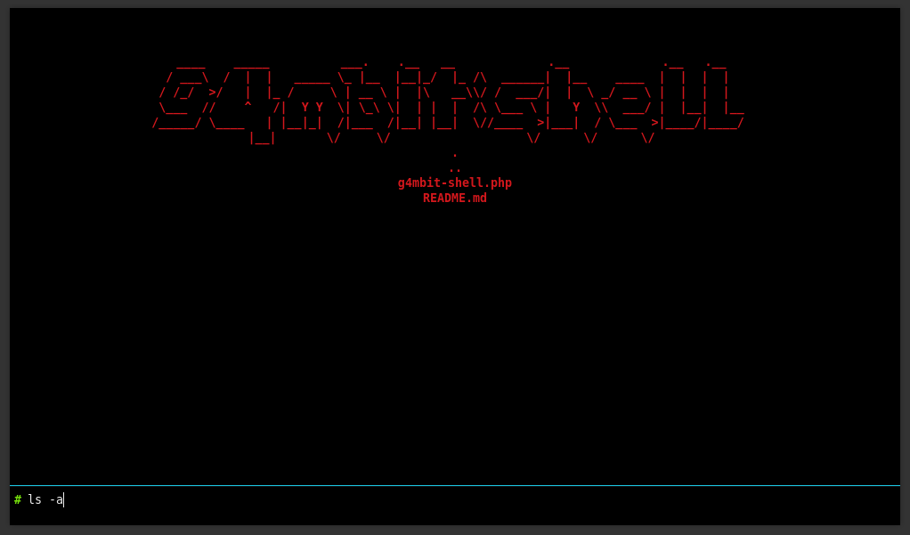

<h1 style="background-color:Black; "> Here is a list of different Web Shells</h1>

<ul> 
    <li>g4mbit-shell.php 
          Uses html, css, and php <b>passthru</b>. NO javascript. Shout out to p0wnyshell for the code reuse.  Allows you to run one off commands just as you would with example_url?cmd=cat /etc/passwd   
</ul>
